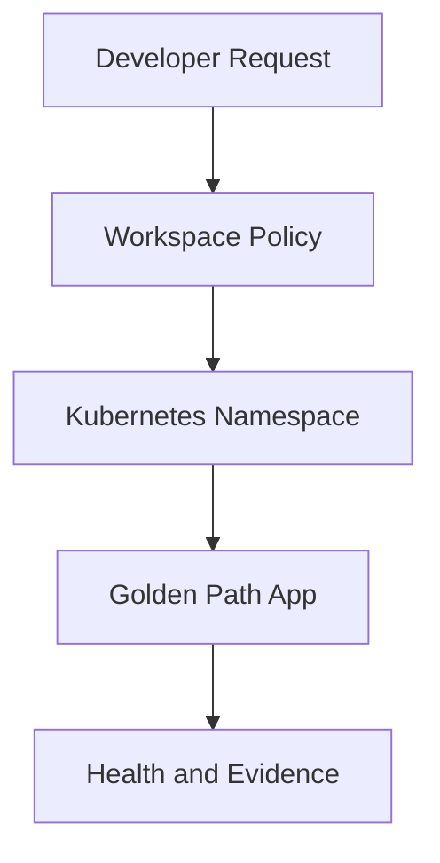

# Internal Developer Platform

A platform engineering reference project that shows how teams can request a standard application workspace, deploy through a golden path, and inherit Kubernetes guardrails, delivery structure, and operating evidence.

## Problem

Application teams often lose time rebuilding the same foundation for every service: namespaces, quotas, RBAC, deployment manifests, health checks, CI/CD conventions and operational documentation. This project defines a repeatable internal platform pattern that gives teams a ready path from repository to runtime.

## Architecture



## What This Proves

- Platform engineering and developer self-service design.
- Kubernetes namespace onboarding with quota and policy thinking.
- Golden-path workload deployment structure.
- Terraform-driven platform configuration.
- Cost-aware validation without leaving live resources running.

## Repository Structure

| Path | Purpose |
| --- | --- |
| `terraform/` | Platform workspace policy and reusable outputs. |
| `kubernetes/` | Golden-path namespace and application manifest. |
| `docs/evidence/` | Validation summary and proof notes. |

## Validation

Run from the repository root:

```powershell
powershell -ExecutionPolicy Bypass -File scripts/validate.ps1
```

## Cost Control

No long-running cloud resources are required for the current version. Live validation should be done in a short window, then destroyed immediately.

## Interview Talking Points

- How a platform team reduces repeated setup work for application teams.
- Why namespace, quota, RBAC and health checks belong in the golden path.
- How GitOps or CI/CD could promote the same manifest across environments.
- What would change for a production-grade implementation.
