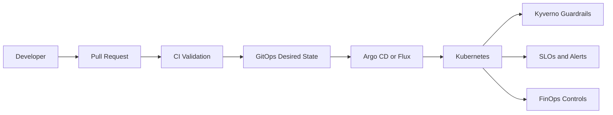

# Internal Developer Platform

A production-oriented platform engineering project that gives application teams a governed golden path from source change to Kubernetes delivery, with GitOps promotion, policy-as-code, SLOs, cost controls and operating runbooks.


## Executive Summary

The platform treats developer experience as an engineering product. Application teams receive a standard workload contract instead of rebuilding namespaces, resource controls, deployment conventions, security requirements and operational signals for every service.

The implementation is designed to be reviewable without keeping paid infrastructure running. CI validates the repository continuously, while the same artifacts can be connected to EKS, AKS or another conformant Kubernetes platform when runtime validation is required.

## Delivery Flow



## Implemented Engineering Scope

| Area | Implementation |
| --- | --- |
| Developer contract | Reusable service template with delivery, security, observability and ownership requirements |
| Infrastructure | Terraform workspace policy and reusable environment outputs |
| Runtime | Kubernetes workload, namespace isolation and resource quotas |
| Packaging | Reusable Helm golden-path chart |
| Promotion | Dev, staging and production GitOps values |
| Policy | Kyverno workload guardrails for resource controls and non-root execution |
| Reliability | Service-level objectives, burn-rate model and Prometheus alert rules |
| Security | Threat model, network isolation and policy enforcement |
| FinOps | Required ownership labels, namespace budgets and review cadence |
| Operations | Deployment-failure and policy-denial runbooks |
| Governance | Architecture decision record making Git the deployment authority |
| Evidence | Local validation records plus GitHub Actions validation |

## Golden Path Contract

The service template in `platform/service-template.yaml` defines the minimum platform contract. A standard service inherits:

- GitOps-based promotion across dev, staging and production.
- Helm-based deployment structure.
- CPU and memory requests and limits.
- Non-root workload expectations.
- Network policy requirements.
- Metrics, logs and alerting expectations.
- Team ownership and cost-center metadata.

Teams can extend the paved road, but exceptions are expected to be explicit and reviewable rather than hidden in one-off configuration.

## Repository Structure

| Path | Purpose |
| --- | --- |
| `platform/` | Service contract and developer-facing golden path |
| `terraform/` | Workspace policy and reusable platform outputs |
| `helm/golden-path/` | Reusable application chart |
| `gitops/environments/` | Dev, staging and production promotion values |
| `kubernetes/` | Namespace, workload, network and quota controls |
| `policies/kyverno/` | Admission-policy guardrails |
| `observability/` | SLO definitions and Prometheus alert rules |
| `finops/` | Cost ownership and optimization guardrails |
| `runbooks/` | Incident and policy-response procedures |
| `docs/adr/` | Architecture decisions |
| `docs/evidence/` | Validation evidence |
| `.github/workflows/` | Continuous platform validation |

## Reliability Model

The sample service targets a 99.9% availability objective and a 99% latency objective under 500 ms. Alerting examples use fast and slow burn-rate windows so the operating model focuses on error-budget consumption instead of isolated metric spikes.

## Security Model

The platform separates source control, CI, GitOps reconciliation and the Kubernetes runtime into distinct trust boundaries. Workloads are expected to run as non-root, declare resource controls and operate behind namespace/network boundaries. The repository also includes a threat model describing the controls used against drift, privilege, lateral movement and weak ownership.

## FinOps Model

Cost is treated as a platform control rather than a reporting afterthought. Required owner and cost-center metadata, environment budgets, non-production scale-down guidance and scheduled rightsizing reviews create an auditable ownership model.

## Failure Handling

The runbooks cover deployment failures and admission-policy denials. The operating principle is to restore from the last known-good Git state, capture evidence, then correct the declarative source instead of normalizing manual cluster drift.

## Validation

Local validation:

```powershell
powershell -ExecutionPolicy Bypass -File scripts/validate.ps1
```

GitHub Actions validates Terraform formatting and configuration, the Helm chart, the Kubernetes workload contract, GitOps environment overlays, policy-as-code, SLO definitions and FinOps controls.

## Architecture Decisions

`docs/adr/0001-gitops-as-deployment-authority.md` records the decision to use Git as the deployment source of truth. This makes promotion, rollback and drift reviewable through the same change history.

## Cost-Controlled Runtime Strategy

This repository does not require an always-on paid cluster to remain useful or reviewable. The platform artifacts, CI validation, diagrams, policies and runbooks remain available after temporary cloud resources are removed. When a live cluster is needed, the same deployment contract can be exercised against a temporary environment and then destroyed.

## Status

The repository contains the platform contract, Helm golden path, GitOps environment promotion, Kubernetes guardrails, Kyverno policy, observability/SLO configuration, FinOps controls, architecture decisions, runbooks and validation evidence.