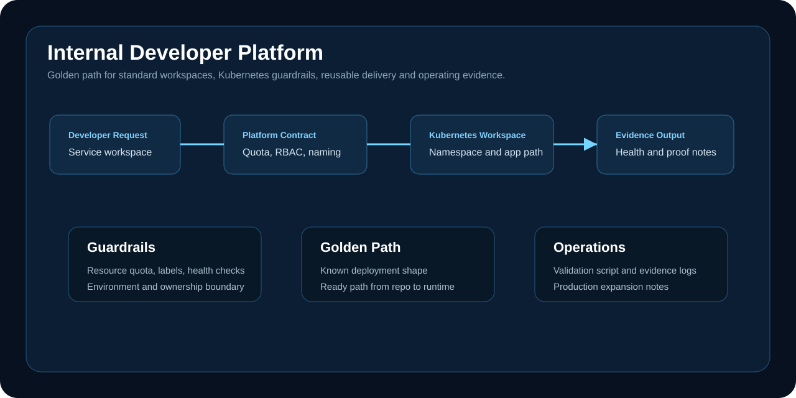

# Internal Developer Platform

A platform engineering project that shows how teams can request a standard application workspace, deploy through a golden path, and inherit Kubernetes guardrails, delivery structure and operating evidence.



## Executive Summary

This project demonstrates the operating model behind an internal developer platform. The goal is not only to deploy a sample workload; it is to define the repeatable path that application teams use so they do not rebuild namespace, quota, RBAC, health checks and delivery conventions for every service.

## Problem

Application teams often lose time rebuilding the same foundation for every service. A platform team should give them a ready workspace with sensible defaults, clear boundaries and a delivery path that can be promoted across environments.

## Engineering Scope

| Area | Implementation |
| --- | --- |
| Developer intake | Standard workspace request model |
| Platform contract | Namespace, naming, quota and ownership pattern |
| Runtime | Kubernetes golden-path app manifest |
| Delivery | Reusable deployment shape ready for CI/CD or GitOps |
| Evidence | Validation script, local validation log and summary notes |
| Operations | Workspace onboarding runbook and production expansion path |

## Repository Structure

| Path | Purpose |
| --- | --- |
| `terraform/` | Platform workspace policy and reusable outputs |
| `kubernetes/` | Golden-path namespace and application manifest |
| `scripts/validate.ps1` | Local validation checks |
| `docs/evidence/` | Validation summary and proof notes |
| `docs/runbooks/` | Workspace onboarding procedure |

## Validation

```powershell
powershell -ExecutionPolicy Bypass -File scripts/validate.ps1
```

## Production Expansion Path

- Connect workspace creation to a service catalog or developer portal.
- Add GitOps promotion through Argo CD or Flux.
- Enforce admission policy with Kyverno, Gatekeeper or cloud-native policy controls.
- Add SSO-backed RBAC and namespace ownership metadata.
- Publish platform SLOs for onboarding time, deployment frequency and failed rollout recovery.

## Interview Defense

The value of this project is the platform operating model. It shows how guardrails, self-service, deployment consistency and evidence fit together. The implementation stays intentionally lightweight so the repo can be validated locally without cost, while the production path is clear.

## Status

Validated as a cost-controlled platform pattern with reusable Kubernetes, Terraform, runbook and evidence artifacts.