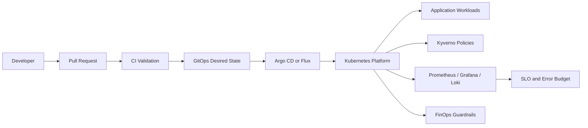

# Platform Architecture

## Design Principles

- Git is the deployment authority and cluster drift is not accepted as normal state.
- Application teams receive a paved road while exceptions remain reviewable.
- Security, reliability, ownership and cost controls are part of the workload contract.
- Environment promotion is explicit from dev to staging to production.
- The repository can be validated without keeping paid infrastructure online.

## Control Plane Responsibilities

The platform layer owns the reusable workload contract, deployment conventions, policy defaults, observability requirements and operating evidence. Application teams own service code, service-specific configuration and approved runtime exceptions.

## Promotion Model

Changes move through pull request validation, dev values, staging values and production values. The GitOps controller reconciles the approved desired state so rollback and drift investigation remain tied to source history.

## Operating Boundaries

The repository demonstrates the architecture and controls without claiming an always-on managed cluster. Runtime infrastructure can be provisioned temporarily for validation and removed afterward without losing the engineering evidence.