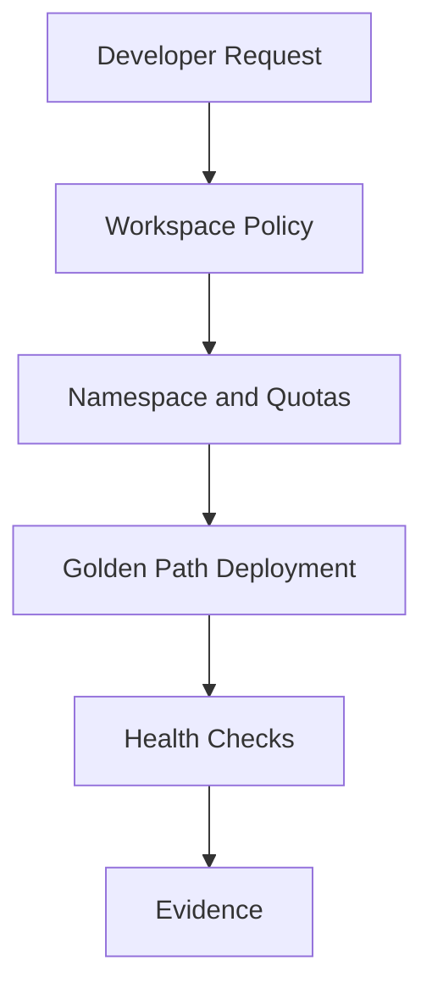

# Architecture

## Design Notes

The platform gives teams a standard onboarding path while keeping controls visible. Each workspace should define ownership, limits, deployment rules and health checks before production promotion.

## Production Extension

A production version would add OIDC-based CI/CD, GitOps sync, policy-as-code, image scanning, secrets integration and SLO dashboards.
